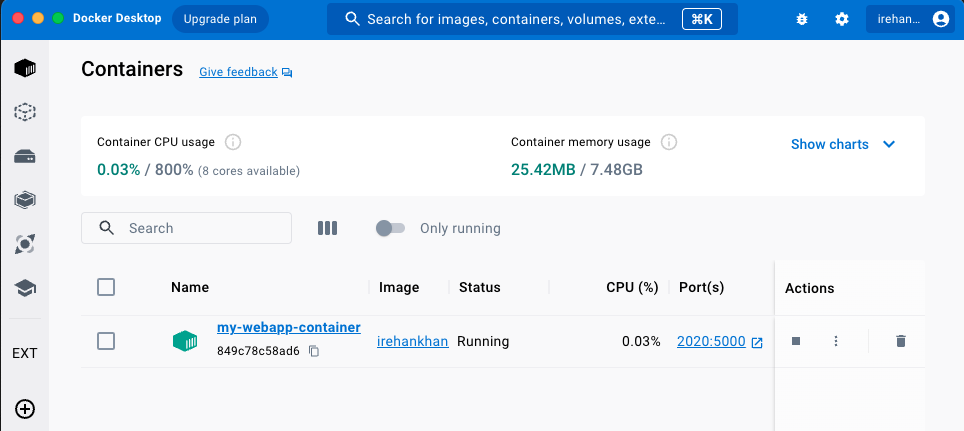

# Docker Containers with Commands
## Docker Container Run Command

```bash 
docker run -p 2020:5000 --name my-webapp-container irehankhan/my-webapp:1.0
```
```bash
irehankhan@Rehans-Mac-mini Assign-1 my-webapp % docker run -p 2020:5000 --name my-webapp-container irehankhan/my-webapp:1.0
 * Serving Flask app 'app.py'
 * Debug mode: off
WARNING: This is a development server. Do not use it in a production deployment. Use a production WSGI server instead.
 * Running on all addresses (0.0.0.0)
 * Running on http://127.0.0.1:5000
 * Running on http://172.17.0.2:5000
Press CTRL+C to quit
192.168.65.1 - - [02/Nov/2023 10:26:11] "GET / HTTP/1.1" 200 -
```

```bash
irehankhan@Rehans-Mac-mini Assign-1 my-webapp % docker run -p 2020:5000 --name my-webapp-container irehankhan/my-webapp:1.0
 * Serving Flask app 'app.py'
 * Debug mode: off
WARNING: This is a development server. Do not use it in a production deployment. Use a production WSGI server instead.
 * Running on all addresses (0.0.0.0)
 * Running on http://127.0.0.1:5000
 * Running on http://172.17.0.2:5000
Press CTRL+C to quit
192.168.65.1 - - [02/Nov/2023 10:26:11] "GET / HTTP/1.1" 200 -
192.168.65.1 - - [02/Nov/2023 10:28:23] "GET /how%20are%20you HTTP/1.1" 200 -
```



## Docker Running Containers

```bash 
docker ps
```
This command will show running containers. Below two Containers are runnig. (89bc57dbd074 & 30f38eba4c58)
```bash
irehankhan@Rehans-Mac-mini Assign-1 my-webapp % docker ps
CONTAINER ID   IMAGE                      COMMAND                  CREATED         STATUS         PORTS                    NAMES
89bc57dbd074   irehankhan/my-webapp:1.0   "/bin/sh -c 'FLASK_A…"   3 minutes ago   Up 3 minutes   0.0.0.0:2021->5000/tcp   my-webapp-container3
30f38eba4c58   irehankhan/my-webapp:1.0   "/bin/sh -c 'FLASK_A…"   4 minutes ago   Up 4 minutes   0.0.0.0:2020->5000/tcp   my-webapp-container
```
```bash 
docker ps -a
```
This command will show all running and stopped containers. Below one container is stopped (4b8492d234fd) and two are running (89bc57dbd074 & 30f38eba4c58)
```bash
irehankhan@Rehans-Mac-mini Assign-1 my-webapp % docker ps -a
CONTAINER ID   IMAGE                      COMMAND                  CREATED         STATUS                       PORTS                    NAMES
4b8492d234fd   irehankhan/my-webapp:1.0   "/bin/sh -c 'FLASK_A…"   3 minutes ago   Exited (137) 2 minutes ago                            my-webapp-container2
89bc57dbd074   irehankhan/my-webapp:1.0   "/bin/sh -c 'FLASK_A…"   4 minutes ago   Up 4 minutes                 0.0.0.0:2021->5000/tcp   my-webapp-container3
30f38eba4c58   irehankhan/my-webapp:1.0   "/bin/sh -c 'FLASK_A…"   5 minutes ago   Up 5 minutes                 0.0.0.0:2020->5000/tcp   my-webapp-container
```
## Stop Docker Running Container
```bash 
docker stop
```
This Command will stop running container. You can see below before running this command two containers are running. When i run this command with the container ID (docker stop 89b) one container stopped and other still running.
```bash
irehankhan@Rehans-Mac-mini Assign-1 my-webapp % docker ps
CONTAINER ID   IMAGE                      COMMAND                  CREATED         STATUS         PORTS                    NAMES
89bc57dbd074   irehankhan/my-webapp:1.0   "/bin/sh -c 'FLASK_A…"   5 minutes ago   Up 5 minutes   0.0.0.0:2021->5000/tcp   my-webapp-container3
30f38eba4c58   irehankhan/my-webapp:1.0   "/bin/sh -c 'FLASK_A…"   6 minutes ago   Up 6 minutes   0.0.0.0:2020->5000/tcp   my-webapp-container
```
```bahs
docker stop 89b
```
```bash
irehankhan@Rehans-Mac-mini Assign-1 my-webapp % docker stop 89b
```
```bash
irehankhan@Rehans-Mac-mini Assign-1 my-webapp % docker ps
CONTAINER ID   IMAGE                      COMMAND                  CREATED         STATUS         PORTS                    NAMES
30f38eba4c58   irehankhan/my-webapp:1.0   "/bin/sh -c 'FLASK_A…"   9 minutes ago   Up 9 minutes   0.0.0.0:2020->5000/tcp   my-webapp-container
```
## Remove Stopped Container
To remove container below command is used with its container id. Below i will embed logs in which i will show all containers and remove one from them. <br>
<i>Note: Before removing contanier first it must be stopped.</i>

```bash 
docker rm <c.id>
```
```bash
CONTAINER ID   IMAGE                      COMMAND                  CREATED          STATUS                        PORTS                    NAMES
4b8492d234fd   irehankhan/my-webapp:1.0   "/bin/sh -c 'FLASK_A…"   31 minutes ago   Exited (137) 30 minutes ago                            my-webapp-container2
89bc57dbd074   irehankhan/my-webapp:1.0   "/bin/sh -c 'FLASK_A…"   33 minutes ago   Exited (137) 25 minutes ago                            my-webapp-container3
30f38eba4c58   irehankhan/my-webapp:1.0   "/bin/sh -c 'FLASK_A…"   34 minutes ago   Up 34 minutes                 0.0.0.0:2020->5000/tcp   my-webapp-container
irehankhan@Rehans-Mac-mini Assign-1 my-webapp %           
```
```bash
irehankhan@Rehans-Mac-mini Assign-1 my-webapp % docker rm 89bc57dbd074
```
```bash
89bc57dbd074
irehankhan@Rehans-Mac-mini Assign-1 my-webapp % 
irehankhan@Rehans-Mac-mini Assign-1 my-webapp % docker ps -a
CONTAINER ID   IMAGE                      COMMAND                  CREATED          STATUS                        PORTS                    NAMES
4b8492d234fd   irehankhan/my-webapp:1.0   "/bin/sh -c 'FLASK_A…"   33 minutes ago   Exited (137) 32 minutes ago                            my-webapp-container2
30f38eba4c58   irehankhan/my-webapp:1.0   "/bin/sh -c 'FLASK_A…"   36 minutes ago   Up 36 minutes                 0.0.0.0:2020->5000/tcp   my-webapp-container
```

##  Docker Container Logs

To Check docker container logs below command is used with contaner id.
```bash
docker logs <id>
```
```bash 
CONTAINER ID   IMAGE                      COMMAND                  CREATED          STATUS          PORTS                    NAMES
30f38eba4c58   irehankhan/my-webapp:1.0   "/bin/sh -c 'FLASK_A…"   45 minutes ago   Up 45 minutes   0.0.0.0:2020->5000/tcp   my-webapp-container
```
```bash
irehankhan@Rehans-Mac-mini Assign-1 my-webapp % docker logs 30f38eba4c58
 * Serving Flask app 'app.py'
 * Debug mode: off
WARNING: This is a development server. Do not use it in a production deployment. Use a production WSGI server instead.
 * Running on all addresses (0.0.0.0)
 * Running on http://127.0.0.1:5000
 * Running on http://172.17.0.2:5000
Press CTRL+C to quit
192.168.65.1 - - [02/Nov/2023 11:25:13] "GET / HTTP/1.1" 200 -
192.168.65.1 - - [02/Nov/2023 11:25:13] "GET /favicon.ico HTTP/1.1" 404 -
192.168.65.1 - - [02/Nov/2023 11:25:18] "GET / HTTP/1.1" 200 -
192.168.65.1 - - [02/Nov/2023 11:25:18] "GET /apple-touch-icon-precomposed.png HTTP/1.1" 404 -
192.168.65.1 - - [02/Nov/2023 11:25:18] "GET /apple-touch-icon.png HTTP/1.1" 404 -
192.168.65.1 - - [02/Nov/2023 11:25:31] "GET /how%20are%20you HTTP/1.1" 200 -
irehankhan@Rehans-Mac-mini Assign-1 my-webapp % 
```
##  Docker Container Inspect

To inspect docker container below command is used with contaner id.

```bash
docker inspect <id>
```
```json
irehankhan@Rehans-Mac-mini Assign-1 my-webapp % docker inspect 30f38eba4c58
[
    {
        "Id": "30f38eba4c58802903a9c59a35b658910e2827e823a32fa3685740ab6fc1f92d",
        "Created": "2023-11-02T10:39:07.13700222Z",
        "Path": "/bin/sh",
        "Args": [
            "-c",
            "FLASK_APP=app.py flask run --host=0.0.0.0"
        ],
        "State": {
            "Status": "running",
            "Running": true,
            "Paused": false,
            "Restarting": false,
            "OOMKilled": false,
            "Dead": false,
            "Pid": 1931,
            "ExitCode": 0,
            "Error": "",
            "StartedAt": "2023-11-02T10:39:07.25830097Z",
            "FinishedAt": "0001-01-01T00:00:00Z"
        },
        "Image": "sha256:2012a08748e7253f6293505183b3c029e9c2665950d3d2112244a0cf1cc19663",
        "ResolvConfPath": "/var/lib/docker/containers/30f38eba4c58802903a9c59a35b658910e2827e823a32fa3685740ab6fc1f92d/resolv.conf",
        "HostnamePath": "/var/lib/docker/containers/30f38eba4c58802903a9c59a35b658910e2827e823a32fa3685740ab6fc1f92d/hostname",
        "HostsPath": "/var/lib/docker/containers/30f38eba4c58802903a9c59a35b658910e2827e823a32fa3685740ab6fc1f92d/hosts",
        "LogPath": "/var/lib/docker/containers/30f38eba4c58802903a9c59a35b658910e2827e823a32fa3685740ab6fc1f92d/30f38eba4c58802903a9c59a35b658910e2827e823a32fa3685740ab6fc1f92d-json.log",
        "Name": "/my-webapp-container",
        "RestartCount": 0,
        "Driver": "overlay2",
        "Platform": "linux",
        "MountLabel": "",
        "ProcessLabel": "",
        "AppArmorProfile": "",
        "ExecIDs": null,
        "HostConfig": {
            "Binds": null,
            "ContainerIDFile": "",
            "LogConfig": {
                "Type": "json-file",
                "Config": {}
            },
            "NetworkMode": "default",
            "PortBindings": {
                "5000/tcp": [
                    {
                        "HostIp": "",
                        "HostPort": "2020"
                    }
                ]
            },
            "RestartPolicy": {
                "Name": "no",
                "MaximumRetryCount": 0
            },
            "AutoRemove": false,
            "VolumeDriver": "",
            "VolumesFrom": null,
            "ConsoleSize": [
                48,
                104
            ],
            "CapAdd": null,
            "CapDrop": null,
            "CgroupnsMode": "private",
            "Dns": [],
            "DnsOptions": [],
            "DnsSearch": [],
            "ExtraHosts": null,
            "GroupAdd": null,
            "IpcMode": "private",
            "Cgroup": "",
            "Links": null,
            "OomScoreAdj": 0,
            "PidMode": "",
            "Privileged": false,
            "PublishAllPorts": false,
            "ReadonlyRootfs": false,
            "SecurityOpt": null,
            "UTSMode": "",
            "UsernsMode": "",
            "ShmSize": 67108864,
            "Runtime": "runc",
            "Isolation": "",
            "CpuShares": 0,
            "Memory": 0,
            "NanoCpus": 0,
            "CgroupParent": "",
            "BlkioWeight": 0,
            "BlkioWeightDevice": [],
            "BlkioDeviceReadBps": [],
            "BlkioDeviceWriteBps": [],
            "BlkioDeviceReadIOps": [],
            "BlkioDeviceWriteIOps": [],
            "CpuPeriod": 0,
            "CpuQuota": 0,
            "CpuRealtimePeriod": 0,
            "CpuRealtimeRuntime": 0,
            "CpusetCpus": "",
            "CpusetMems": "",
            "Devices": [],
            "DeviceCgroupRules": null,
            "DeviceRequests": null,
            "MemoryReservation": 0,
            "MemorySwap": 0,
            "MemorySwappiness": null,
            "OomKillDisable": null,
            "PidsLimit": null,
            "Ulimits": null,
            "CpuCount": 0,
            "CpuPercent": 0,
            "IOMaximumIOps": 0,
            "IOMaximumBandwidth": 0,
            "MaskedPaths": [
                "/proc/asound",
                "/proc/acpi",
                "/proc/kcore",
                "/proc/keys",
                "/proc/latency_stats",
                "/proc/timer_list",
                "/proc/timer_stats",
                "/proc/sched_debug",
                "/proc/scsi",
                "/sys/firmware"
            ],
            "ReadonlyPaths": [
                "/proc/bus",
                "/proc/fs",
                "/proc/irq",
                "/proc/sys",
                "/proc/sysrq-trigger"
            ]
        },
        "GraphDriver": {
            "Data": {
                "LowerDir": "/var/lib/docker/overlay2/3b4d55086e163c6d4d53b416f0d09ab77b0b39e0b67aa7ecf10b17d73ce877b3-init/diff:/var/lib/docker/overlay2/majleaq9pcfxrwbe4umd5tuvd/diff:/var/lib/docker/overlay2/n8isdvey3pbfqbcike6kgx4k1/diff:/var/lib/docker/overlay2/ogrnhbx3o04jnn7d65156zsw6/diff:/var/lib/docker/overlay2/84llfwndeeeatuwa1amud1n7h/diff:/var/lib/docker/overlay2/tyizj1gonstwl0uyn5cs78o95/diff:/var/lib/docker/overlay2/sofye1kcpmwcm722vuracc8ui/diff:/var/lib/docker/overlay2/003f0d7604bcf0e051e22b0b9931601442a96db82aa912aea971c60259714ada/diff",
                "MergedDir": "/var/lib/docker/overlay2/3b4d55086e163c6d4d53b416f0d09ab77b0b39e0b67aa7ecf10b17d73ce877b3/merged",
                "UpperDir": "/var/lib/docker/overlay2/3b4d55086e163c6d4d53b416f0d09ab77b0b39e0b67aa7ecf10b17d73ce877b3/diff",
                "WorkDir": "/var/lib/docker/overlay2/3b4d55086e163c6d4d53b416f0d09ab77b0b39e0b67aa7ecf10b17d73ce877b3/work"
            },
            "Name": "overlay2"
        },
        "Mounts": [],
        "Config": {
            "Hostname": "30f38eba4c58",
            "Domainname": "",
            "User": "",
            "AttachStdin": false,
            "AttachStdout": false,
            "AttachStderr": false,
            "ExposedPorts": {
                "5000/tcp": {}
            },
            "Tty": false,
            "OpenStdin": false,
            "StdinOnce": false,
            "Env": [
                "PATH=/usr/local/sbin:/usr/local/bin:/usr/sbin:/usr/bin:/sbin:/bin"
            ],
            "Cmd": null,
            "Image": "irehankhan/my-webapp:1.0",
            "Volumes": null,
            "WorkingDir": "",
            "Entrypoint": [
                "/bin/sh",
                "-c",
                "FLASK_APP=app.py flask run --host=0.0.0.0"
            ],
            "OnBuild": null,
            "Labels": {
                "org.opencontainers.image.ref.name": "ubuntu",
                "org.opencontainers.image.version": "22.04"
            }
        },
        "NetworkSettings": {
            "Bridge": "",
            "SandboxID": "d887bfef2b2367c01439df64dbb65cbd5b40cceb75460fa8992bdff1242c511a",
            "HairpinMode": false,
            "LinkLocalIPv6Address": "",
            "LinkLocalIPv6PrefixLen": 0,
            "Ports": {
                "5000/tcp": [
                    {
                        "HostIp": "0.0.0.0",
                        "HostPort": "2020"
                    }
                ]
            },
            "SandboxKey": "/var/run/docker/netns/d887bfef2b23",
            "SecondaryIPAddresses": null,
            "SecondaryIPv6Addresses": null,
            "EndpointID": "da9fee988ac71161c5a020dfa0af06b93001e6fce60eb6021761b30098c9f3d9",
            "Gateway": "172.17.0.1",
            "GlobalIPv6Address": "",
            "GlobalIPv6PrefixLen": 0,
            "IPAddress": "172.17.0.2",
            "IPPrefixLen": 16,
            "IPv6Gateway": "",
            "MacAddress": "02:42:ac:11:00:02",
            "Networks": {
                "bridge": {
                    "IPAMConfig": null,
                    "Links": null,
                    "Aliases": null,
                    "NetworkID": "436b31c371e658e10f2c62995b9dae627360b8e2f70a26ce0632c1a59c6c9380",
                    "EndpointID": "da9fee988ac71161c5a020dfa0af06b93001e6fce60eb6021761b30098c9f3d9",
                    "Gateway": "172.17.0.1",
                    "IPAddress": "172.17.0.2",
                    "IPPrefixLen": 16,
                    "IPv6Gateway": "",
                    "GlobalIPv6Address": "",
                    "GlobalIPv6PrefixLen": 0,
                    "MacAddress": "02:42:ac:11:00:02",
                    "DriverOpts": null
                }
            }
        }
    }
]
```
## Docker Exec Command
Docker Exec command is used to execute a command in a running container.
```bash
docker exec <options> CONTAINER NAME <Command>Í
```
First of all i used below command to execute in container and create a file using touch command in container directory media folder named "inside-container-test-file.txt"
```bash
irehankhan@Rehans-Mac-mini Assign-1 my-webapp % docker exec my-webapp-container touch /media/inside-container-test-file.txt
```
To verify from outside container that the file is created on mentioned directory i used below command (ls -la)
```bash
docker exec my-webapp-container ls -la /media
```
```bash
irehankhan@Rehans-Mac-mini Assign-1 my-webapp % docker exec my-webapp-container ls -la /media                              
total 8
drwxr-xr-x 1 root root 4096 Nov  2 12:11 .
drwxr-xr-x 1 root root 4096 Nov  2 12:10 ..
-rw-r--r-- 1 root root    0 Nov  2 12:11 inside-container-test-file.txt
```
Now i use exec command with interactive, tty option/mode to used container bash shell and add some text in above file.
```bash
irehankhan@Rehans-Mac-mini Assign-1 my-webapp % docker exec -it my-webapp-container bash 
```
Below are the logs
```bash
irehankhan@Rehans-Mac-mini Assign-1 my-webapp % docker exec -it my-webapp-container bash
root@30f38eba4c58:/#   
root@30f38eba4c58:/# ls
__pycache__  app.py  bin  boot  dev  etc  home  lib  media  mnt  opt  proc  requirements.txt  root  run  sbin  srv  sys  tmp  usr  var
root@30f38eba4c58:/# 
root@30f38eba4c58:/# cd media
root@30f38eba4c58:/media# 
root@30f38eba4c58:/media# ls
inside-container-test-file.txt
root@30f38eba4c58:/media# 
root@30f38eba4c58:/media# cat > inside-container-test-file.txt 

Hello!
This is a test file to check if a file can be created from outside container.
Also this text is written in this file using bash shell of this container to check.

Thank You.

Regards,
Rehan
^C
root@30f38eba4c58:/media# ls
inside-container-test-file.txt
root@30f38eba4c58:/media# cat inside-container-test-file.txt 

Hello!
This is a test file to check if a file can be created from outside container.
Also this text is written in this file using bash shell of this container to check.

Thank You.

Regards,
Rehan
root@30f38eba4c58:/media#
root@30f38eba4c58:/media# exit
exit
irehankhan@Rehans-Mac-mini Assign-1 my-webapp % docker exec my-webapp-container cat /media/inside-container-test-file.txt

Hello!
This is a test file to check if a file can be created from outside container.
Also this text is written in this file using bash shell of this container to check.

Thank You.

Regards,
Rehan
irehankhan@Rehans-Mac-mini Assign-1 my-webapp % 
```
## Docker Attach Command
```bash
docker attach <id>
```
First i run a caontainer in detached mode then using above command i attached it again to the terminal. Please check below log<br>
<i>Note: The attach command will display the output of the ENTRYPOINT process.</i>

```bash
irehankhan@Rehans-Mac-mini Assign-1 my-webapp % docker run -d -p 2024:5000 --name my-webapp-contanier4 irehankhan/my-webapp:1.0 
8faea85eed1e4fe8e954fd996553d2c75c962fd72a460464dfa121b47b927669
irehankhan@Rehans-Mac-mini Assign-1 my-webapp % docker attach 8faea85eed1e4fe8e954fd996553d2c75c962fd72a460464dfa121b47b927669  
192.168.65.1 - - [02/Nov/2023 12:44:36] "GET / HTTP/1.1" 200 -
192.168.65.1 - - [02/Nov/2023 12:44:36] "GET /favicon.ico HTTP/1.1" 404 -
192.168.65.1 - - [02/Nov/2023 12:44:46] "GET /how%20are%20you HTTP/1.1" 200 -
192.168.65.1 - - [02/Nov/2023 12:45:24] "GET / HTTP/1.1" 200 -
192.168.65.1 - - [02/Nov/2023 12:45:24] "GET /favicon.ico HTTP/1.1" 404 -
192.168.65.1 - - [02/Nov/2023 12:45:34] "GET /how%20are%20you HTTP/1.1" 200 -
192.168.65.1 - - [02/Nov/2023 12:46:52] "GET / HTTP/1.1" 200 -
192.168.65.1 - - [02/Nov/2023 12:46:59] "GET /how%20are%20you HTTP/1.1" 200 -
```
## Docker Commit Command
Creates a New Image from a container
```bash
docker commit <CONTAINER NAME> <NEW IMAGE NAME:TAG >

docker commit 30f38eba4c58 irehankhan/create-new-image-from-my-webapp-container 
```
I have created a new image (irehankhan/create-new-image-from-my-webapp-container) from container (30f38eba4c58) using above command. Below are the logs
```bash
irehankhan@Rehans-Mac-mini Assign-1 my-webapp % docker ps
CONTAINER ID   IMAGE                      COMMAND                  CREATED          STATUS          PORTS                    NAMES
8faea85eed1e   irehankhan/my-webapp:1.0   "/bin/sh -c 'FLASK_A…"   21 minutes ago   Up 21 minutes   0.0.0.0:2024->5000/tcp   my-webapp-contanier4
30f38eba4c58   irehankhan/my-webapp:1.0   "/bin/sh -c 'FLASK_A…"   2 hours ago      Up 3 minutes    0.0.0.0:2020->5000/tcp   my-webapp-container

irehankhan@Rehans-Mac-mini Assign-1 my-webapp % docker commit 30f38eba4c58 irehankhan/create-new-image-from-my-webapp-container    
sha256:5a8bca840ffb02ff199d119f92d9b7de64e3d603608a3d35a1cb1ca8e0956e3c
irehankhan@Rehans-Mac-mini Assign-1 my-webapp % 

irehankhan@Rehans-Mac-mini Assign-1 my-webapp % docker images
REPOSITORY                                             TAG       IMAGE ID       CREATED         SIZE
irehankhan/create-new-image-from-my-webapp-container   latest    5a8bca840ffb   8 seconds ago   450MB
irehankhan/my-webapp                                   1.0       2012a08748e7   22 hours ago    450MB
irehankhan@Rehans-Mac-mini Assign-1 my-webapp % docker run -d -p 2026:5000 --name my-webapp-container irehankhan/create-new-image-from-my-webapp-container

irehankhan@Rehans-Mac-mini Assign-1 my-webapp % docker run -d -p 2026:5000 --name my-webapp-container-t irehankhan/create-new-image-from-my-webapp-container
c2363d0664197541048aa641d894fdf51282e138d35f86d4507ecf00bafea35d
irehankhan@Rehans-Mac-mini Assign-1 my-webapp % docker ps
CONTAINER ID   IMAGE                                                  COMMAND                  CREATED          STATUS          PORTS                    NAMES
c2363d066419   irehankhan/create-new-image-from-my-webapp-container   "/bin/sh -c 'FLASK_A…"   6 seconds ago    Up 5 seconds    0.0.0.0:2026->5000/tcp   my-webapp-container-t
8faea85eed1e   irehankhan/my-webapp:1.0                               "/bin/sh -c 'FLASK_A…"   26 minutes ago   Up 26 minutes   0.0.0.0:2024->5000/tcp   my-webapp-contanier4
30f38eba4c58   irehankhan/my-webapp:1.0                               "/bin/sh -c 'FLASK_A…"   2 hours ago      Up 7 minutes    0.0.0.0:2020->5000/tcp   my-webapp-container
irehankhan@Rehans-Mac-mini Assign-1 my-webapp % 
```
## Docker Copy Command
```bash
docker cp <Container Name:Container _path> <Host_path>
docker cp <Host_path> <Container Name:Container _path>
```
Commands i Used
```bash
Container to Host

docker cp my-webapp-container:/media/inside-container-test-file.txt /Users/irehankhan/Documents/Assign-1-my-webapp/docker-shared-folder

Host to Container

docker cp /Users/irehankhan/Documents/Assign-1-my-webapp/docker-shared-folder/test-file.txt my-webapp-container:/media/
```
Docker cp command is used to copy files/folders between a container and a host/local filesystem.

Please check below logs in which i copied inside-container-test-file.txt from container (my-webapp-container) media directory to my host folder docker-share-folder and verified using ls command on host that if the file is copied.

Secondly i copied test-file.txt from my host folder docker-shared-folder to my contanier (my-webapp-container) media directory and verified using exec + ls command on container that if the file is copied.
```bash
irehankhan@Rehans-Mac-mini docker-shared-folder % docker exec my-webapp-container ls media 
inside-container-test-file.txt
irehankhan@Rehans-Mac-mini docker-shared-folder % docker cp my-webapp-container:/media/inside-container-test-file.txt /Users/irehankhan/Documents/Assign-1-my-webapp/docker-shared-folder
                                               Successfully copied 2.05kB to /Users/irehankhan/Documents/Assign-1-my-webapp/docker-shared-folder
irehankhan@Rehans-Mac-mini docker-shared-folder % ls
inside-container-test-file.txt	test-file.txt
irehankhan@Rehans-Mac-mini docker-shared-folder % 
irehankhan@Rehans-Mac-mini docker-shared-folder % docker cp /Users/irehankhan/Documents/Assign-1-my-webapp/docker-shared-folder/test-file.txt my-webapp-container:/media/
                                             Successfully copied 1.54kB to my-webapp-container:/media/
irehankhan@Rehans-Mac-mini docker-shared-folder % 
irehankhan@Rehans-Mac-mini docker-shared-folder % docker exec my-webapp-container ls media
inside-container-test-file.txt
test-file.txt
irehankhan@Rehans-Mac-mini docker-shared-folder % 
```
## Docekr Stats Command
This command is used to check resource usage/statistics of specific container or all containers and display as a live stream on terminal and we can also use an option (--no-stream) in this command to diable streaming stats and pull the first result only.
```bash
docker stats or docker stats --no-stream
```
Logs
```bash
irehankhan@Rehans-Mac-mini Assign-1-my-webapp % docker stats
CONTAINER ID   NAME                    CPU %     MEM USAGE / LIMIT     MEM %     NET I/O           BLOCK I/O    PIDS
c2363d066419   my-webapp-container-t   0.03%     20.11MiB / 7.661GiB   0.26%     1.26kB / 0B       0B / 0B      2
8faea85eed1e   my-webapp-contanier4    0.02%     22.89MiB / 7.661GiB   0.29%     8.99kB / 5.01kB   0B / 4.1kB   2
30f38eba4c58   my-webapp-container     0.03%     20.42MiB / 7.661GiB   0.26%     4.74kB / 1.99kB   0B / 0B      3

irehankhan@Rehans-Mac-mini Assign-1-my-webapp % docker stats --no-stream
CONTAINER ID   NAME                    CPU %     MEM USAGE / LIMIT     MEM %     NET I/O           BLOCK I/O    PIDS
c2363d066419   my-webapp-container-t   0.03%     20.11MiB / 7.661GiB   0.26%     1.26kB / 0B       0B / 0B      2
8faea85eed1e   my-webapp-contanier4    0.04%     22.89MiB / 7.661GiB   0.29%     8.99kB / 5.01kB   0B / 4.1kB   2
30f38eba4c58   my-webapp-container     0.02%     20.4MiB / 7.661GiB    0.26%     4.92kB / 2.09kB   0B / 0B      2
```
## Docker Top Command
Docker top command is used to display the running processes inside a container. This command provides a list of the running processes of a container without logging in to the container with container id or name.
```bash
docker top Container_Name
```
logs
```bash
irehankhan@Rehans-Mac-mini Assign-1-my-webapp % docker top my-webapp-container
UID                 PID                 PPID                C                   STIME               TTY                 TIME                CMD
root                9527                9502                0                   13:01               ?                   00:00:00            /bin/sh -c FLASK_APP=app.py flask run --host=0.0.0.0
root                9549                9527                0                   13:01               ?                   00:00:01            /usr/bin/python3 /usr/local/bin/flask run --host=0.0.0.0
irehankhan@Rehans-Mac-mini Assign-1-my-webapp % 
```
## Docker Start Command
This Command is used to start a stopped container.
```bash
docker start <c.id>
```
In below Logs container with id 4b8492d234fd is stopped and i started it again using docker start 4b8492d234fd command.
```bash
irehankhan@Rehans-Mac-mini Assign-1-my-webapp % docker ps -a
CONTAINER ID   IMAGE                                                  COMMAND                  CREATED       STATUS                     PORTS                    NAMES
c2363d066419   irehankhan/create-new-image-from-my-webapp-container   "/bin/sh -c 'FLASK_A…"   2 hours ago   Up 2 hours                 0.0.0.0:2026->5000/tcp   my-webapp-container-t
8faea85eed1e   irehankhan/my-webapp:1.0                               "/bin/sh -c 'FLASK_A…"   2 hours ago   Up 2 hours                 0.0.0.0:2024->5000/tcp   my-webapp-contanier4
4b8492d234fd   irehankhan/my-webapp:1.0                               "/bin/sh -c 'FLASK_A…"   4 hours ago   Exited (137) 4 hours ago                            my-webapp-container2
30f38eba4c58   irehankhan/my-webapp:1.0                               "/bin/sh -c 'FLASK_A…"   4 hours ago   Up 2 hours                 0.0.0.0:2020->5000/tcp   my-webapp-container

irehankhan@Rehans-Mac-mini Assign-1-my-webapp % docker start 4b8492d234fd
4b8492d234fd

irehankhan@Rehans-Mac-mini Assign-1-my-webapp % docker ps -a             
CONTAINER ID   IMAGE                                                  COMMAND                  CREATED       STATUS         PORTS                    NAMES
c2363d066419   irehankhan/create-new-image-from-my-webapp-container   "/bin/sh -c 'FLASK_A…"   2 hours ago   Up 2 hours     0.0.0.0:2026->5000/tcp   my-webapp-container-t
8faea85eed1e   irehankhan/my-webapp:1.0                               "/bin/sh -c 'FLASK_A…"   2 hours ago   Up 2 hours     0.0.0.0:2024->5000/tcp   my-webapp-contanier4
4b8492d234fd   irehankhan/my-webapp:1.0                               "/bin/sh -c 'FLASK_A…"   4 hours ago   Up 7 seconds   0.0.0.0:2022->5000/tcp   my-webapp-container2
30f38eba4c58   irehankhan/my-webapp:1.0                               "/bin/sh -c 'FLASK_A…"   4 hours ago   Up 2 hours     0.0.0.0:2020->5000/tcp   my-webapp-container
irehankhan@Rehans-Mac-mini Assign-1-my-webapp % 
```
## Docker Pause Command
Docker pause command is used to pause a running container.
```bash
docker pause <c.id>
```
In below Logs container with id 4b8492d234fd is running and i pause it using docker pause 4b8492d234fd command.
```bash
irehankhan@Rehans-Mac-mini Assign-1-my-webapp % docker ps
CONTAINER ID   IMAGE                                                  COMMAND                  CREATED       STATUS         PORTS                    NAMES
c2363d066419   irehankhan/create-new-image-from-my-webapp-container   "/bin/sh -c 'FLASK_A…"   2 hours ago   Up 2 hours     0.0.0.0:2026->5000/tcp   my-webapp-container-t
8faea85eed1e   irehankhan/my-webapp:1.0                               "/bin/sh -c 'FLASK_A…"   2 hours ago   Up 2 hours     0.0.0.0:2024->5000/tcp   my-webapp-contanier4
4b8492d234fd   irehankhan/my-webapp:1.0                               "/bin/sh -c 'FLASK_A…"   4 hours ago   Up 5 minutes   0.0.0.0:2022->5000/tcp   my-webapp-container2
30f38eba4c58   irehankhan/my-webapp:1.0                               "/bin/sh -c 'FLASK_A…"   4 hours ago   Up 2 hours     0.0.0.0:2020->5000/tcp   my-webapp-container

irehankhan@Rehans-Mac-mini Assign-1-my-webapp % docker pause 4b8492d234fd
4b8492d234fd

irehankhan@Rehans-Mac-mini Assign-1-my-webapp % docker ps -a
CONTAINER ID   IMAGE                                                  COMMAND                  CREATED       STATUS                  PORTS                    NAMES
c2363d066419   irehankhan/create-new-image-from-my-webapp-container   "/bin/sh -c 'FLASK_A…"   2 hours ago   Up 2 hours              0.0.0.0:2026->5000/tcp   my-webapp-container-t
8faea85eed1e   irehankhan/my-webapp:1.0                               "/bin/sh -c 'FLASK_A…"   2 hours ago   Up 2 hours              0.0.0.0:2024->5000/tcp   my-webapp-contanier4
4b8492d234fd   irehankhan/my-webapp:1.0                               "/bin/sh -c 'FLASK_A…"   4 hours ago   Up 6 minutes (Paused)   0.0.0.0:2022->5000/tcp   my-webapp-container2
30f38eba4c58   irehankhan/my-webapp:1.0                               "/bin/sh -c 'FLASK_A…"   4 hours ago   Up 2 hours              0.0.0.0:2020->5000/tcp   my-webapp-container
irehankhan@Rehans-Mac-mini Assign-1-my-webapp %
```
## Docker Unpause Command
Docker unpause command is used to unpause a Paused container.
```bash
docker unpause <c.id>
```
In below Logs container with id 4b8492d234fd is Paused and i unpause it using docker unpause 4b8492d234fd command.
```bash
irehankhan@Rehans-Mac-mini Assign-1-my-webapp % docker ps -a
CONTAINER ID   IMAGE                                                  COMMAND                  CREATED       STATUS                  PORTS                    NAMES
c2363d066419   irehankhan/create-new-image-from-my-webapp-container   "/bin/sh -c 'FLASK_A…"   2 hours ago   Up 2 hours              0.0.0.0:2026->5000/tcp   my-webapp-container-t
8faea85eed1e   irehankhan/my-webapp:1.0                               "/bin/sh -c 'FLASK_A…"   2 hours ago   Up 2 hours              0.0.0.0:2024->5000/tcp   my-webapp-contanier4
4b8492d234fd   irehankhan/my-webapp:1.0                               "/bin/sh -c 'FLASK_A…"   4 hours ago   Up 6 minutes (Paused)   0.0.0.0:2022->5000/tcp   my-webapp-container2
30f38eba4c58   irehankhan/my-webapp:1.0                               "/bin/sh -c 'FLASK_A…"   4 hours ago   Up 2 hours              0.0.0.0:2020->5000/tcp   my-webapp-container

irehankhan@Rehans-Mac-mini Assign-1-my-webapp % docker unpause 4b8492d234fd
4b8492d234fd

irehankhan@Rehans-Mac-mini Assign-1-my-webapp % docker ps
CONTAINER ID   IMAGE                                                  COMMAND                  CREATED       STATUS          PORTS                    NAMES
c2363d066419   irehankhan/create-new-image-from-my-webapp-container   "/bin/sh -c 'FLASK_A…"   2 hours ago   Up 2 hours      0.0.0.0:2026->5000/tcp   my-webapp-container-t
8faea85eed1e   irehankhan/my-webapp:1.0                               "/bin/sh -c 'FLASK_A…"   2 hours ago   Up 2 hours      0.0.0.0:2024->5000/tcp   my-webapp-contanier4
4b8492d234fd   irehankhan/my-webapp:1.0                               "/bin/sh -c 'FLASK_A…"   4 hours ago   Up 12 minutes   0.0.0.0:2022->5000/tcp   my-webapp-container2
30f38eba4c58   irehankhan/my-webapp:1.0                               "/bin/sh -c 'FLASK_A…"   4 hours ago   Up 2 hours      0.0.0.0:2020->5000/tcp   my-webapp-container
irehankhan@Rehans-Mac-mini Assign-1-my-webapp % 
```
## Docker Rename Command
```bash
docker rename <Container_Name> <New_Name>
```
Docker Rename command is used to rename a container. I used "docker rename my-webapp-container2 my-webapp-container-renamed" command to rename my container 4b8492d234fd in below log
```bash
irehankhan@Rehans-Mac-mini Assign-1-my-webapp % docker ps -a  
CONTAINER ID   IMAGE                                                  COMMAND                  CREATED       STATUS          PORTS                    NAMES
c2363d066419   irehankhan/create-new-image-from-my-webapp-container   "/bin/sh -c 'FLASK_A…"   2 hours ago   Up 2 hours      0.0.0.0:2026->5000/tcp   my-webapp-container-t
8faea85eed1e   irehankhan/my-webapp:1.0                               "/bin/sh -c 'FLASK_A…"   2 hours ago   Up 2 hours      0.0.0.0:2024->5000/tcp   my-webapp-contanier4
4b8492d234fd   irehankhan/my-webapp:1.0                               "/bin/sh -c 'FLASK_A…"   4 hours ago   Up 17 minutes   0.0.0.0:2022->5000/tcp   my-webapp-container2
30f38eba4c58   irehankhan/my-webapp:1.0                               "/bin/sh -c 'FLASK_A…"   4 hours ago   Up 2 hours      0.0.0.0:2020->5000/tcp   my-webapp-container

irehankhan@Rehans-Mac-mini Assign-1-my-webapp % docker rename my-webapp-container2 my-webapp-container-renamed

irehankhan@Rehans-Mac-mini Assign-1-my-webapp % 
irehankhan@Rehans-Mac-mini Assign-1-my-webapp % docker ps -a
CONTAINER ID   IMAGE                                                  COMMAND                  CREATED       STATUS          PORTS                    NAMES
c2363d066419   irehankhan/create-new-image-from-my-webapp-container   "/bin/sh -c 'FLASK_A…"   2 hours ago   Up 2 hours      0.0.0.0:2026->5000/tcp   my-webapp-container-t
8faea85eed1e   irehankhan/my-webapp:1.0                               "/bin/sh -c 'FLASK_A…"   2 hours ago   Up 2 hours      0.0.0.0:2024->5000/tcp   my-webapp-contanier4
4b8492d234fd   irehankhan/my-webapp:1.0                               "/bin/sh -c 'FLASK_A…"   4 hours ago   Up 20 minutes   0.0.0.0:2022->5000/tcp   my-webapp-container-renamed
30f38eba4c58   irehankhan/my-webapp:1.0                               "/bin/sh -c 'FLASK_A…"   4 hours ago   Up 2 hours      0.0.0.0:2020->5000/tcp   my-webapp-container
irehankhan@Rehans-Mac-mini Assign-1-my-webapp % 
```
## Docker Wait Command
```bash
docker wait Container_Name
```
Is used to wait for a container to exit and then display its exit code. In below screenshot i run docker container with the name "my-test-container" in background (detached mode) then i used "docker wait my-test-container" command.<br>
After that i opened another terminal window below and run a command to stop this container to check exit code in above terminal (Exit Code: "137")


## Docker Attach Command
```bash
docker attach <id>
```
First i run a caontainer in detached mode then using above command i attached it again to the terminal. Please check below log<br>
<i>Note: The attach command will display the output of the ENTRYPOINT process.</i>

```bash
irehankhan@Rehans-Mac-mini Assign-1 my-webapp % docker run -d -p 2024:5000 --name my-webapp-contanier4 irehankhan/my-webapp:1.0 
8faea85eed1e4fe8e954fd996553d2c75c962fd72a460464dfa121b47b927669
irehankhan@Rehans-Mac-mini Assign-1 my-webapp % docker attach 8faea85eed1e4fe8e954fd996553d2c75c962fd72a460464dfa121b47b927669  
192.168.65.1 - - [02/Nov/2023 12:44:36] "GET / HTTP/1.1" 200 -
192.168.65.1 - - [02/Nov/2023 12:44:36] "GET /favicon.ico HTTP/1.1" 404 -
192.168.65.1 - - [02/Nov/2023 12:44:46] "GET /how%20are%20you HTTP/1.1" 200 -
192.168.65.1 - - [02/Nov/2023 12:45:24] "GET / HTTP/1.1" 200 -
192.168.65.1 - - [02/Nov/2023 12:45:24] "GET /favicon.ico HTTP/1.1" 404 -
192.168.65.1 - - [02/Nov/2023 12:45:34] "GET /how%20are%20you HTTP/1.1" 200 -
192.168.65.1 - - [02/Nov/2023 12:46:52] "GET / HTTP/1.1" 200 -
192.168.65.1 - - [02/Nov/2023 12:46:59] "GET /how%20are%20you HTTP/1.1" 200 -
```
## Docker port Command
Docker port command is used to display the public facing port that a container is listening on
```bash
docker port <container_name>

docker port my-webapp-container
```
```bash
irehankhan@Rehans-Mac-mini Assign-1-my-webapp % docker ps
CONTAINER ID   IMAGE                      COMMAND                  CREATED       STATUS       PORTS                    NAMES
8faea85eed1e   irehankhan/my-webapp:1.0   "/bin/sh -c 'FLASK_A…"   4 hours ago   Up 4 hours   0.0.0.0:2024->5000/tcp   my-webapp-contanier4
4b8492d234fd   irehankhan/my-webapp:1.0   "/bin/sh -c 'FLASK_A…"   6 hours ago   Up 2 hours   0.0.0.0:2022->5000/tcp   my-webapp-container-renamed
30f38eba4c58   irehankhan/my-webapp:1.0   "/bin/sh -c 'FLASK_A…"   6 hours ago   Up 3 hours   0.0.0.0:2020->5000/tcp   my-webapp-container

irehankhan@Rehans-Mac-mini Assign-1-my-webapp % docker port my-webapp-container

5000/tcp -> 0.0.0.0:2020
```
## Docker Update command
```bash
docker update <options> <container_names...>

I used

docker update --memory-swap 100M -m 50M my-test-container-1
```
Docker update command is used to update a single or multiple container's resource limits. <br>

In below log first i checked stats of my container "my-test-container-1" memory limit which was "7.661Gib" then using docker update command i updated it to "50Mib". <br>In above command i used "--memory-swap" option with -m (memory limit) option because for changing memory limit, swap memory must be changed and with greater value as you can see -m (memory limit) is 50MiB while --memory-swap is 100Mib. 
```bash
irehankhan@Rehans-Mac-mini Assign-1-my-webapp % docker stats --no-stream my-test-container-1
CONTAINER ID   NAME                  CPU %     MEM USAGE / LIMIT     MEM %     NET I/O     BLOCK I/O    PIDS
377d38636ffd   my-test-container-1   0.04%     19.75MiB / 7.661GiB   0.25%     796B / 0B   0B / 4.1kB   2

irehankhan@Rehans-Mac-mini Assign-1-my-webapp % docker update --memory-swap 100M -m 50M my-test-container-1    

my-test-container-1

irehankhan@Rehans-Mac-mini Assign-1-my-webapp % docker stats --no-stream my-test-container-1               
CONTAINER ID   NAME                  CPU %     MEM USAGE / LIMIT   MEM %     NET I/O     BLOCK I/O    PIDS
377d38636ffd   my-test-container-1   0.02%     20.35MiB / 50MiB    40.70%    866B / 0B   0B / 4.1kB   2
irehankhan@Rehans-Mac-mini Assign-1-my-webapp % 
```
## Docker Restart command
Docker command is used to restart a container
```bash
docker restart container_name
```
In below Logs i stopped contaner "my-webapp-container" and then restart it.
```bash
irehankhan@Rehans-Mac-mini Assign-1-my-webapp % docker stop my-webapp-container
my-webapp-container
irehankhan@Rehans-Mac-mini Assign-1-my-webapp % docker ps  -a                  
CONTAINER ID   IMAGE                                                  COMMAND                  CREATED          STATUS                       PORTS                    NAMES
377d38636ffd   irehankhan/my-webapp:1.0                               "/bin/sh -c 'FLASK_A…"   33 minutes ago   Up 33 minutes                0.0.0.0:2029->5000/tcp   my-test-container-1
c2363d066419   irehankhan/create-new-image-from-my-webapp-container   "/bin/sh -c 'FLASK_A…"   4 hours ago      Exited (137) 2 hours ago                              my-webapp-container-t
8faea85eed1e   irehankhan/my-webapp:1.0                               "/bin/sh -c 'FLASK_A…"   5 hours ago      Up 5 hours                   0.0.0.0:2024->5000/tcp   my-webapp-contanier4
4b8492d234fd   irehankhan/my-webapp:1.0                               "/bin/sh -c 'FLASK_A…"   7 hours ago      Up 3 hours                   0.0.0.0:2022->5000/tcp   my-webapp-container-renamed
30f38eba4c58   irehankhan/my-webapp:1.0                               "/bin/sh -c 'FLASK_A…"   7 hours ago      Exited (137) 6 seconds ago                            my-webapp-container

irehankhan@Rehans-Mac-mini Assign-1-my-webapp % docker restart my-webapp-container 
my-webapp-container

irehankhan@Rehans-Mac-mini Assign-1-my-webapp % docker ps  -a                     
CONTAINER ID   IMAGE                                                  COMMAND                  CREATED          STATUS                     PORTS                    NAMES
377d38636ffd   irehankhan/my-webapp:1.0                               "/bin/sh -c 'FLASK_A…"   34 minutes ago   Up 34 minutes              0.0.0.0:2029->5000/tcp   my-test-container-1
c2363d066419   irehankhan/create-new-image-from-my-webapp-container   "/bin/sh -c 'FLASK_A…"   4 hours ago      Exited (137) 2 hours ago                            my-webapp-container-t
8faea85eed1e   irehankhan/my-webapp:1.0                               "/bin/sh -c 'FLASK_A…"   5 hours ago      Up 5 hours                 0.0.0.0:2024->5000/tcp   my-webapp-contanier4
4b8492d234fd   irehankhan/my-webapp:1.0                               "/bin/sh -c 'FLASK_A…"   7 hours ago      Up 3 hours                 0.0.0.0:2022->5000/tcp   my-webapp-container-renamed
30f38eba4c58   irehankhan/my-webapp:1.0                               "/bin/sh -c 'FLASK_A…"   7 hours ago      Up 4 seconds               0.0.0.0:2020->5000/tcp   my-webapp-container
```
<h1></h1>
<h1 style="text-align: center;">Thank You!</h1>

